# GenQuick

<div align="center">


**AI 智能助手，让处理更高效**

[](https://github.com/yourusername/genquick)
[](LICENSE)
[](https://tauri.app)
[](https://vuejs.org)

[English](README_EN.md) | 简体中文

</div>

---

## 项目简介

GenQuick 是一款基于 Tauri 2 + Vue 3 开发的 AI 智能助手桌面应用。通过快捷键快速唤起，支持多种 AI 模型，提供文本处理、图表生成、图像编辑等功能，让您的日常工作更加高效。

**核心特点:**

- 快捷高效 - 按 `Alt + 1` 即可唤起，自动获取选中文本
- 多模型支持 - 支持 OpenAI、Claude、Gemini、Ollama 等多种 AI 模型
- 智能提示词 - 内置 15 种专业提示词，支持自定义和优化
- 图表生成 - 支持 Mermaid、Graphviz、ECharts、词云、思维导图等 5 种图表
- 图像编辑 - 内置图像编辑器，支持标注、马赛克、文字等功能
- 主题切换 - 支持亮色/暗色/跟随系统三种主题模式
- 本地存储 - 所有配置本地存储，保护您的隐私

---

## 功能特性

### 快捷菜单系统

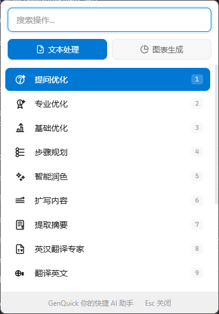

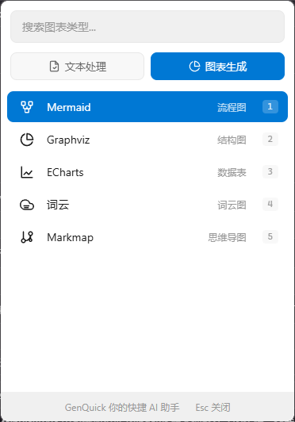

- 全局快捷键: `Alt + 1` 快速唤起应用
- 智能定位: 窗口自动显示在鼠标位置附近
- 自动获取: 自动获取当前选中的文本内容
- 快速插入: 支持插入、替换、追加等多种操作

### AI 文本处理

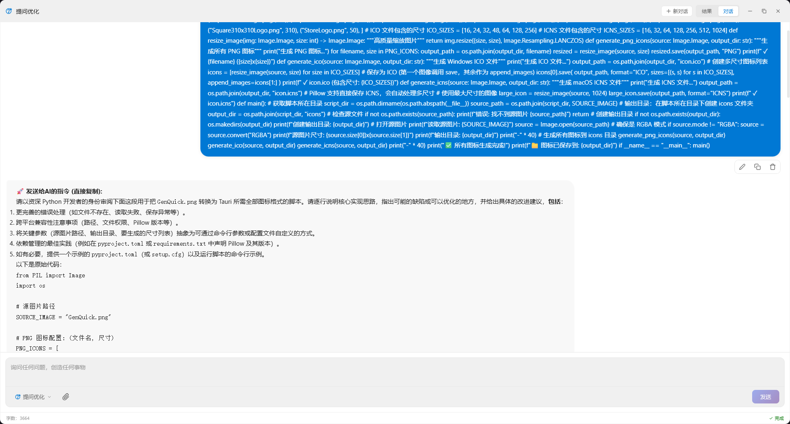

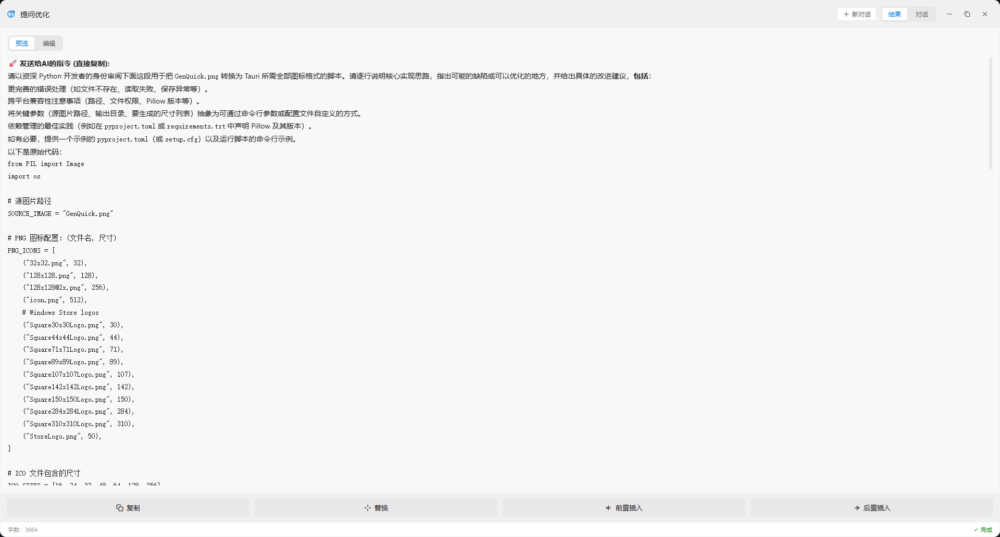

**内置提示词 (15 种):**

| 类型       | 提示词                                 |
| ---------- | -------------------------------------- |
| 优化类     | 提问优化、专业优化、基础优化、步骤规划 |
| 写作类     | 智能润色、扩写内容、提取摘要           |
| 翻译类     | 英汉翻译专家、翻译英文、翻译中文       |
| 办公类     | 工作日报、去除AI味                     |
| 提示词优化 | 系统提示词优化、专业系统提示词         |

**提示词管理:**

- 支持自定义提示词
- 提示词分类管理
- 拖拽排序
- 提示词评分和优化建议

### 图表生成

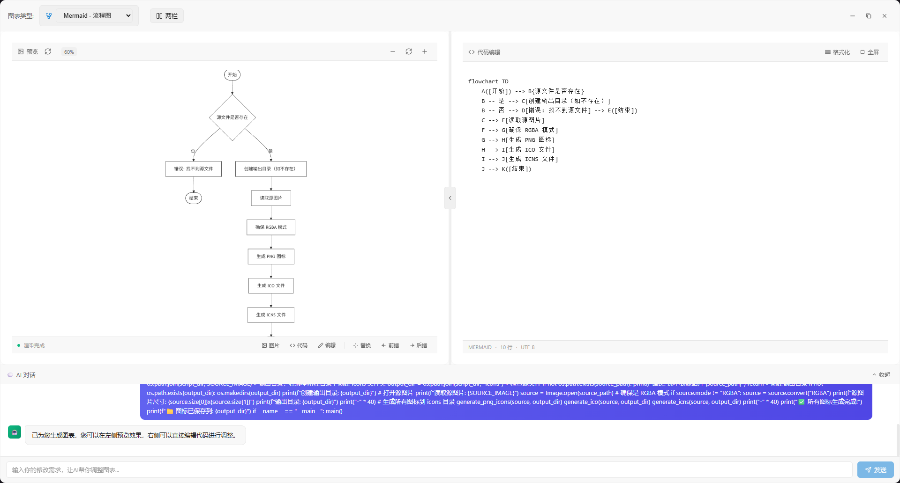

支持 5 种主流图表类型:

| 图表类型 | 适用场景                     | 示例               |
| -------- | ---------------------------- | ------------------ |
| Mermaid  | 流程图、时序图、类图、状态图 | 流程设计、系统架构 |
| Graphviz | 结构图、关系图               | 复杂关系展示       |
| ECharts  | 数据可视化、统计图表         | 数据分析、报表     |
| 词云     | 文本分析、关键词提取         | 文章关键词可视化   |
| Markmap  | 思维导图                     | 知识梳理、脑图     |

**图表功能:**

- 实时预览
- 导出为 PNG 图片
- 复制到剪贴板
- 自定义样式

### 图像编辑器

基于 Fabric.js 的图像编辑器:

**工具栏:**

- 画笔、荧光笔、橡皮擦
- 直线、箭头、矩形、圆形
- 文字标注
- 马赛克

**操作:**

- 撤销/重做
- 复制到剪贴板
- 插入到文档

### 设置管理

**常规设置:**

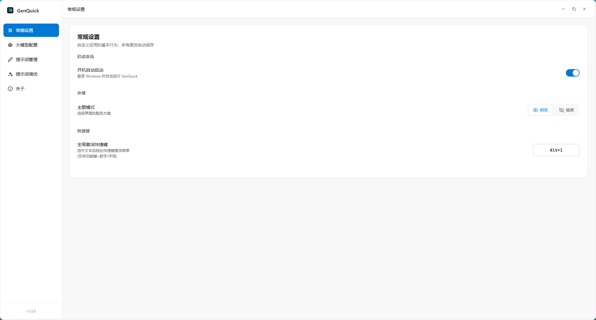

- 开机自启动
- 主题模式切换
- 快捷键自定义
- 语言设置

**API 配置:**

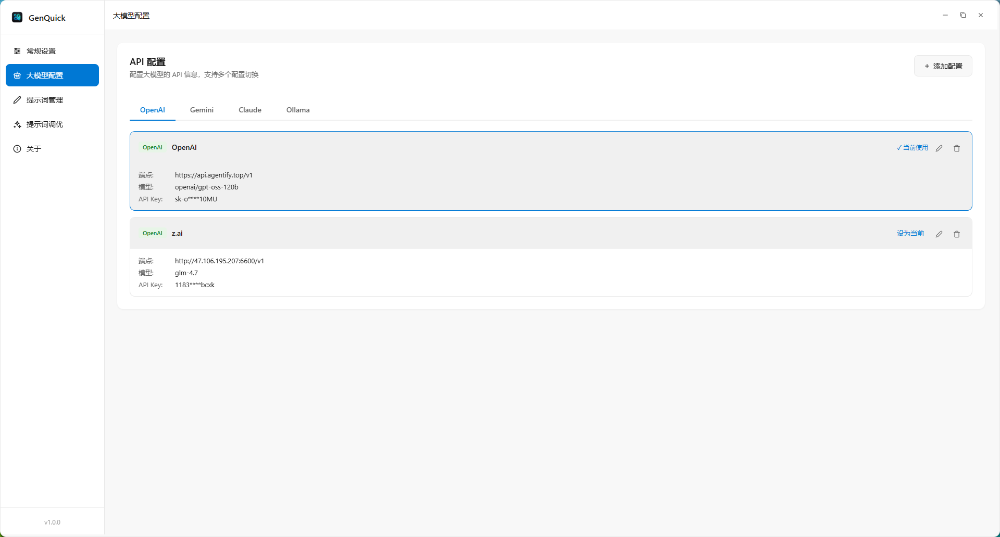

- 多配置管理
- 一键切换
- 支持的模型: OpenAI（兼容）、Claude、Gemini、Ollama

**提示词管理:**

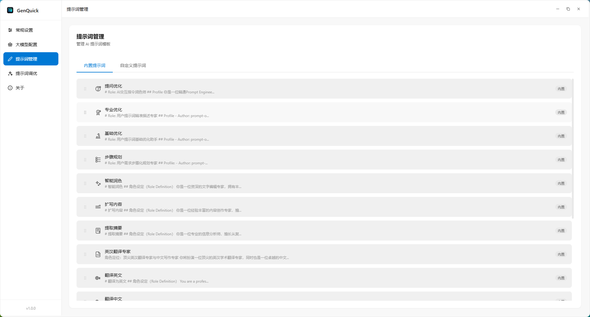

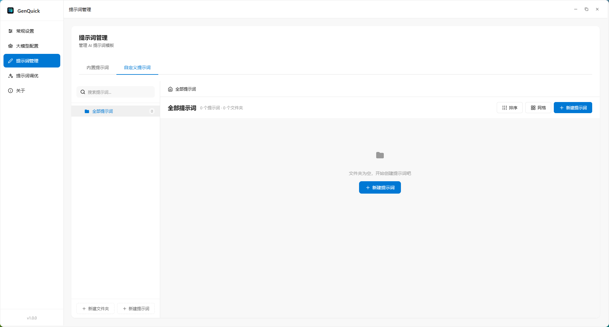

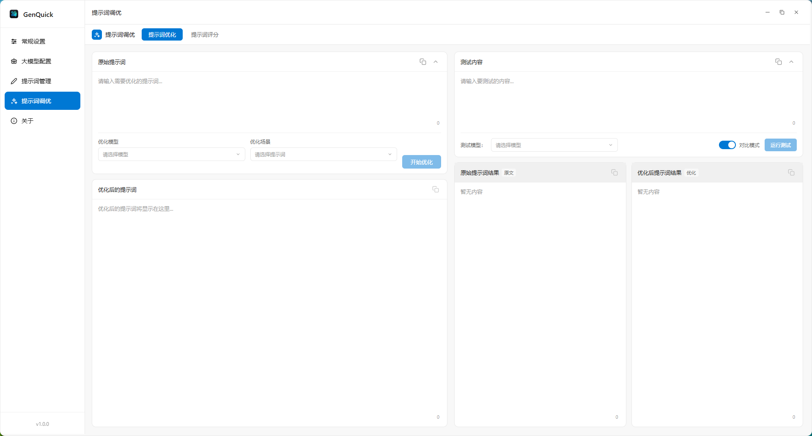

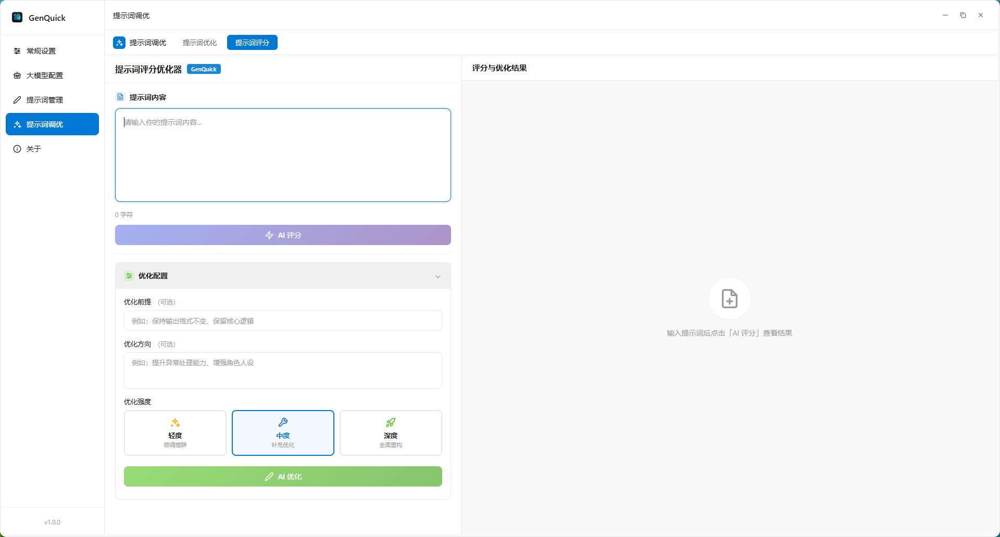

- 内置提示词查看
- 自定义提示词添加
- 提示词优化建议
- 提示词评分系统

**关于页面:**

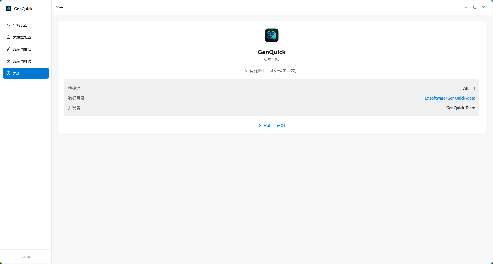

---

## 快速开始

### 环境要求

- Node.js: >= 18.0.0
- pnpm: >= 8.0.0 (推荐) 或 npm/yarn
- Rust: >= 1.70.0
- 操作系统: Windows 10/11, macOS 10.15+, Linux

### 从源码构建

```bash
# 1. 克隆仓库
git clone https://gitee.com/fall-in-love-with-hawaii/gen-quick.git
cd gen-quick

# 2. 进入前端目录
cd quickui

# 3. 安装依赖
pnpm install

# 4. 开发模式运行
pnpm tauri dev

# 5. 生产构建
pnpm tauri build
```

构建完成后，安装包位于 `quickui/src-tauri/target/release/bundle/` 目录。

### 开发命令

```bash
# 前端开发
pnpm dev

# 前端构建
pnpm build

# Tauri 开发模式
pnpm tauri dev

# Tauri 生产构建
pnpm tauri build
```

---

## 使用指南

### 首次使用

1. **配置 API**

   - 点击托盘图标 → 设置
   - 进入"大模型配置"
   - 添加您的 API 配置 (API Key, Endpoint, Model)
   - 点击"激活"按钮
2. **设置快捷键** (可选)

   - 进入"常规设置"
   - 修改快捷键 (默认 Alt+1)
3. **开始使用**

   - 在任意应用中选中文本
   - 按 `Alt + 1` 唤起 GenQuick
   - 选择提示词进行处理

### 常用操作

**文本处理:**

```
1. 选中文本 → Alt+1 → 选择提示词 → 查看结果
2. 结果操作:
   - 复制: 复制到剪贴板
   - 插入: 插入到原位置
   - 替换: 替换选中文本
   - 追加: 追加到文末
```

**图表生成:**

```
1. 选中文本 → Alt+1 → 切换到"图表生成"标签
2. 选择图表类型
3. AI 自动生成图表代码
4. 预览、导出或复制
```

**图像编辑:**

```
1. 截图或打开图片
2. 使用工具栏进行标注
3. 复制或插入到文档
```

---

## 项目结构

```
gen-quick/
├── quickui/                    # 前端项目
│   ├── src/
│   │   ├── components/         # Vue 组件 (23 个)
│   │   │   ├── ChartPanel.vue  # 图表面板
│   │   │   ├── QuickMenu.vue   # 快捷菜单
│   │   │   ├── ResultPanel.vue # 结果面板
│   │   │   ├── ImageEditor/    # 图像编辑器
│   │   │   ├── settings/       # 设置组件 (8 个)
│   │   │   └── common/         # 通用组件
│   │   ├── views/              # 页面视图
│   │   │   ├── MainView.vue    # 主视图
│   │   │   └── SettingsView.vue # 设置视图
│   │   ├── stores/             # Pinia 状态管理
│   │   │   ├── config.ts       # API 配置
│   │   │   ├── prompts.ts      # 提示词管理
│   │   │   └── settings.ts     # 应用设置
│   │   ├── composables/        # 组合式函数
│   │   │   ├── useAI.ts        # AI 请求
│   │   │   └── useToast.ts     # 提示消息
│   │   ├── utils/              # 工具函数
│   │   │   ├── chartRenderer.ts # 图表渲染
│   │   │   └── imageProcessor.ts # 图像处理
│   │   ├── types/              # TypeScript 类型
│   │   ├── styles/             # 样式文件 (17 个)
│   │   └── assets/             # 静态资源
│   ├── src-tauri/              # Rust 后端
│   │   ├── src/
│   │   │   ├── lib.rs          # 主库入口
│   │   │   ├── ai.rs           # AI 请求处理
│   │   │   ├── keyboard.rs     # 键盘监听
│   │   │   ├── clipboard.rs    # 剪贴板操作
│   │   │   ├── config.rs       # 配置管理
│   │   │   ├── settings.rs     # 设置管理
│   │   │   ├── tray.rs         # 系统托盘
│   │   │   └── commands/       # Tauri 命令
│   │   ├── Cargo.toml          # Rust 依赖
│   │   └── tauri.conf.json     # Tauri 配置
│   ├── package.json            # npm 依赖
│   ├── vite.config.ts          # Vite 配置
│   └── tsconfig.json           # TypeScript 配置
└── genquick-script/            # 图标资源
    ├── GenQuick.png            # 源图标 (1024x1024)
    ├── convert_icons.py        # 图标转换脚本
    └── icons/                  # 各尺寸图标 (16 个)
```

---

## 技术架构

### 前端技术栈

- 框架: Vue 3 (Composition API) + TypeScript
- 构建工具: Vite 6
- 状态管理: Pinia 3
- 路由: Vue Router 4
- UI: 自定义 CSS/SCSS (无第三方组件库)
- 图表库:
  - Mermaid 11 (流程图)
  - ECharts 5 (数据可视化)
  - Graphviz (结构图)
  - Markmap (思维导图)
- 图像编辑: Fabric.js 7
- 其他:
  - marked (Markdown 解析)
  - highlight.js (代码高亮)
  - html2canvas (截图)

### 后端技术栈

- 桌面框架: Tauri 2
- 语言: Rust (Edition 2021)
- 异步运行时: Tokio
- HTTP 客户端: reqwest
- 序列化: serde + serde_json
- 系统交互:
  - enigo (键盘鼠标模拟)
  - rdev (全局事件监听)
  - tauri-plugin-clipboard-manager (剪贴板)
  - tauri-plugin-global-shortcut (全局快捷键)

### 数据流

```
用户选中文本
    ↓
按 Alt+1 唤起
    ↓
Rust 后端: 备份剪贴板 → 模拟 Ctrl+C → 读取文本 → 恢复剪贴板
    ↓
前端: 显示快捷菜单
    ↓
用户选择提示词
    ↓
Rust 后端: 发送 AI 请求 (流式)
    ↓
前端: 实时显示结果
    ↓
用户操作: 复制/插入/替换
    ↓
Rust 后端: 写入剪贴板/模拟键盘操作
```

---

## 数据存储

所有数据存储在本地，位于应用所在目录的 `data/` 文件夹:

```
data/
├── api-config.json      # API 配置
├── prompt-config.json   # 提示词配置
├── settings.json        # 应用设置
├── text-cache.json      # 文本缓存
└── app.log              # 应用日志
```

**隐私保护:**

- 所有配置本地存储
- 不上传任何用户数据
- API Key 加密存储
- 支持完全离线使用 (Ollama 模式)

---

## 性能优化

- 快速启动: Tauri 2 优化，启动时间 < 1s
- 小体积: 安装包约 10MB (Windows)
- 低内存: 运行时内存占用 < 100MB
- 流畅动画: 60fps 流畅体验
- 智能缓存: 提示词和配置缓存

---

## 常见问题

### Q: 如何配置 API?

**A:**

1. 打开设置 → 大模型配置
2. 点击"添加配置"
3. 选择 API 类型 (OpenAI/Claude/Gemini/Ollama)
4. 填写 Endpoint、API Key、Model
5. 点击"激活"按钮

### Q: 支持 Ollama 本地模型吗?

**A:** 支持！配置步骤:

1. 安装并启动 Ollama
2. 添加配置，类型选择 "Ollama"
3. Endpoint 填写 `http://localhost:11434`
4. Model 填写模型名称 (如 `llama3`, `qwen2.5`)
5. API Key 留空即可

### Q: 如何修改快捷键?

**A:**

1. 打开设置 → 常规设置
2. 修改快捷键 (支持 Ctrl/Shift/Alt + 字母/数字)
3. 保存后立即生效

### Q: 数据存储在哪里?

**A:** 所有数据存储在应用所在目录的 `data/` 文件夹，包括:

- API 配置
- 提示词配置
- 应用设置
- 日志文件

### Q: 如何添加自定义提示词?

**A:**

1. 打开设置 → 提示词管理
2. 切换到"自定义提示词"标签
3. 点击"添加提示词"
4. 填写名称、图标、提示词内容
5. 保存后即可使用

### Q: 支持图片输入吗?

**A:** 支持！在对话模式下可以:

1. 粘贴图片 (Ctrl+V)
2. 选择图片文件
3. AI 会自动识别图片内容

### Q: 如何导出图表?

**A:**

1. 生成图表后，点击"复制图片"按钮
2. 图表会以 PNG 格式复制到剪贴板
3. 可以直接粘贴到任意应用

---

## 贡献指南

我们欢迎所有形式的贡献！

### 如何贡献

1. Fork 本仓库
2. 创建特性分支 (`git checkout -b feature/AmazingFeature`)
3. 提交更改 (`git commit -m 'Add some AmazingFeature'`)
4. 推送到分支 (`git push origin feature/AmazingFeature`)
5. 提交 Pull Request

---

## 开源协议

本项目基于 [MIT 协议](LICENSE) 开源。

```
MIT License

Copyright (c) 2024 GenQuick

Permission is hereby granted, free of charge, to any person obtaining a copy
of this software and associated documentation files (the "Software"), to deal
in the Software without restriction, including without limitation the rights
to use, copy, modify, merge, publish, distribute, sublicense, and/or sell
copies of the Software, and to permit persons to whom the Software is
furnished to do so, subject to the following conditions:

The above copyright notice and this permission notice shall be included in all
copies or substantial portions of the Software.

THE SOFTWARE IS PROVIDED "AS IS", WITHOUT WARRANTY OF ANY KIND, EXPRESS OR
IMPLIED, INCLUDING BUT NOT LIMITED TO THE WARRANTIES OF MERCHANTABILITY,
FITNESS FOR A PARTICULAR PURPOSE AND NONINFRINGEMENT. IN NO EVENT SHALL THE
AUTHORS OR COPYRIGHT HOLDERS BE LIABLE FOR ANY CLAIM, DAMAGES OR OTHER
LIABILITY, WHETHER IN AN ACTION OF CONTRACT, TORT OR OTHERWISE, ARISING FROM,
OUT OF OR IN CONNECTION WITH THE SOFTWARE OR THE USE OR OTHER DEALINGS IN THE
SOFTWARE.
```

---

## 致谢

感谢以下开源项目:

- [Tauri](https://tauri.app/) - 跨平台桌面应用框架
- [Vue.js](https://vuejs.org/) - 渐进式 JavaScript 框架
- [Mermaid](https://mermaid.js.org/) - 基于 JavaScript 的图表工具
- [ECharts](https://echarts.apache.org/) - 强大的可视化库
- [Fabric.js](http://fabricjs.com/) - Canvas 库
- [Markmap](https://markmap.js.org/) - 思维导图库
- [prompt-optimizer](https://github.com/linshenkx/prompt-optimizer) - 提示词优化框架和评估工具，感谢 [linshenkx](https://github.com/linshenkx) 的贡献

### 特别致谢

感谢所有关注、使用和支持本项目的佬友！你们的反馈和建议是项目不断改进的动力。

---

## 联系方式

- 项目主页: [https://github.com/Sweetberrys/GenQuick](https://github.com/Sweetberrys/GenQuick)
- 问题反馈: [Issues](https://github.com/Sweetberrys/GenQuick/issues)
- 功能建议: [Discussions](https://github.com/Sweetberrys/GenQuick/discussions)

### 微信交流

欢迎扫码添加微信，交流项目使用心得和建议：


---

<div align="center">

**如果这个项目对您有帮助，请给一个 Star 支持一下！**

Made with love by GenQuick Team

</div>
